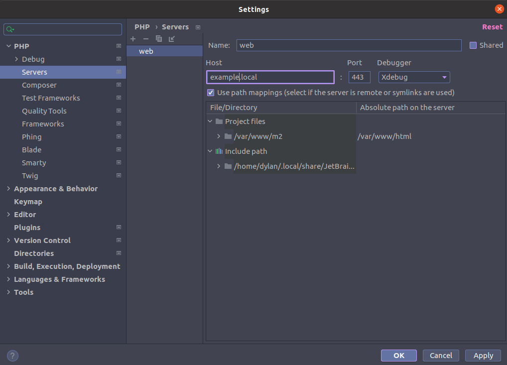

# Docker Magento

Docker magento support

* php:7.4.20
* composer:2.1.3
* mysql:8.0
* opensearch:1.2.4
* php-myadmin

Docker support php libraries

* bcmath
* ctype
* curl
* dom
* gd
* hash
* iconv
* intl
* mbstring
* openssl
* pdo_mysql
* simplexml
* soap
* spl
* xsl
* zip
* libxml
* xdebug 3
* opache
* apcu
* memcached
* curl

# How to use

## Init project
```bash

git clone https://github.com/dylanops/docker-magento

cd docker-magento

mv .env.sample .env

mkdir -p data/backup data/os-data data/os-plugins data/mysql-data

Edit config on the .env file

// .env

PROJECT_PATH=/home/dylan/ggg/www/magento

MYSQL_DATABASE=mysqldb
MYSQL_USER=magento
MYSQL_PASSWORD=123456
MYSQL_ROOT_PASSWORD=123456

BLACKFIRE_LOG_LEVEL=1
BLACKFIRE_SERVER_ID=
BLACKFIRE_SERVER_TOKEN=
BLACKFIRE_CLIENT_ID=
BLACKFIRE_CLIENT_TOKEN=

```

## Create self credentials
```bash
cd /conf/nginx
openssl req -newkey rsa:4096 \
            -x509 \
            -sha256 \
            -days 3650 \
            -nodes \
            -out local.crt \
            -keyout local.key
```

## Config nginx domain/ssl
```
cp conf/nginx/default.conf.sample conf/nginx/default.conf

```

## Edit hosts file in local workstation
```
vim /etc/hosts

Add line

127.0.0.1 magento.local
```

## Start/Stop docker
```bash
docker-compose up -d
docker-compose down -v

```

## Setup magento
```bash
php bin/magento setup:install --base-url=https://m244ee.local/ \
--db-host=mysql --db-name=m244ee --db-user=root --db-password=123456 \
--admin-firstname=Dylan --admin-lastname=Ngo --admin-email=it.dylanngo@gmail.com \
--admin-user=admin --admin-password=admin123 --language=vi_VN --currency=VND --timezone=Asia/Ho_Chi_Minh \
--session-save=db --use-rewrites=1 --use-secure=1 --use-secure-admin=1 --elasticsearch-host=opensearch --elasticsearch-port=9200 --search-engine=elasticsearch7 --elasticsearch-index-prefix=m244ee --elasticsearch-enable-auth=false --cleanup-database
```

## Move database to backup folder, It'll help you to import database.

## XDebug config with PhpStorm




## OPCache Toolkit
```bash
# default opcache off

docker exec -ti --user root php bash

# Clean OPCache
opcache clean


# Enable OPCache
opcache on

# Disable OPCache
opcache off

```

## XDebug Toolkit
```bash
# default xdebug off

docker exec -ti --user root php bash

xdebug -h

# Enable XDebug
xdebug on

# Disable XDebug
xdebug off

```

## Install opensearch plugins

```bash
docker exec -ti opensearch bash

/usr/share/opensearch/bin/opensearch-plugin install --batch analysis-icu analysis-phonetic
```

## Start Cronjob
```bash

=====> Start cron service

docker exec -ti --user root bash

service cron start

exit

====> Add cron to crontab

docker exec -ti php bash

php bin/magento cron:install

crontab -l

```

## Goto mysql admin

Go to mysqladmin: http://localhost:8080


## Setup gitlab CI/CD

```bash

export PRIVATE_KEY=$(cat ./private-key.pem)

echo "$PRIVATE_KEY"

eval $(ssh-agent -s)

echo "$SSH_PRIVATE_KEY" | tr -d '\r' | ssh-add -

ssh -o UserKnownHostsFile=/dev/null -o StrictHostKeyChecking=no "$SERVER_USER"@"$SERVER_HOST"

```
